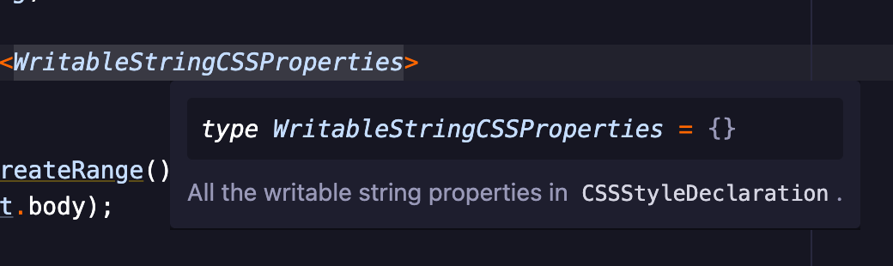

# pulsar-hover

Contextual hints for Pulsar.

<p>
  
</p>

Designed as a replacement for both `atom-ide-datatip` and `atom-ide-signature-help`.

## Services

### Hover information and datatips

This package can show most datatips from [packages that consume Atom IDE’s `datatip` service](https://web.pulsar-edit.dev/packages?serviceType=consumed&service=datatip), but it purposefully drops support for some of that service’s arcane features. You probably won’t miss them. All the stuff provided by most IDE packages is supported.

Because the `datatip` service is a bit bloated and (strangely) inverts the consumer/provider relationship, this package prefers a new service called `hover`. When searching for a provider for a particular editor pane, [`hover` providers](https://web.pulsar-edit.dev/packages?serviceType=provided&service=hover) will be given priority over `datatip` consumers.

(The `hover` service may not yet have _any_ providers at time of release, but some will emerge after the provider implementation is added to `@savetheclocktower/atom-languageclient`).

### Signature help

This package also provides the Atom IDE `signature-help` service so it can offer contextual “signature help” while you’re typing the arguments of a function call. This takes the form of an “overlay” editor decoration above your cursor.

In order to do this job for a given language, it needs [a consumer of `signature-help`](https://web.pulsar-edit.dev/packages?serviceType=consumed&service=signature-help) that operates on files of that type.

By default, this signature help will appear automatically when appropriate while you type, but you can configure it to appear only after the invocation of a command instead.

Again, because `signature-help` inverts the consumer/provider relationship, this package prefers a new service called `signature`. When searching for a signature help provider for a particular editor pane, [`signature` providers](https://web.pulsar-edit.dev/packages?serviceType=consumed&service=signature) will be given priority over `signature-help` consumers.


## Commands

|Command|Description|Keybinding (Linux/Windows)|Keybinding (macOS)|
|-------|-----------|------------------|-----------------|
|`pulsar-hover:toggle`|Toggle hover information visibility at cursor|<kbd>ctrl-alt-h</kbd>|<kbd>cmd-opt-h</kbd>|
|`pulsar-hover:toggle-signature-help`|Toggle signature help visibility at cursor|<kbd>ctrl-alt-j</kbd>|<kbd>cmd-opt-j</kbd>|

## Configuration

### `pulsar-hover.hover.showOnCursorMove`

Whether to show the overlay automatically when the cursor moves to a new location. Defaults to `false`, meaning you must invoke the `pulsar-hover:toggle` command to show/hide the overlay at the cursor position.

### `pulsar-hover.hover.showOnMouseMove`

Whether to show the overlay automatically when the mouse pointer moves to a new location within the active editor. Defaults to `true`. When disabled, mouse activity will not trigger the showing of hover overlays.

### `pulsar-hover.hover.hoverTime`

How long (in milliseconds) to wait before asking for hover information on mouse or cursor rest; also how long for the hover overlay to linger on screen after mouse or cursor movement. Defaults to `250`.

### `pulsar-hover.signatureHelp.showOverlayWhileTyping`

Whether to show the signature help overlay automatically while the user types function parameters. When enabled, the appropriate overlay should show for each of the parameters of a given function and should close once you’re done typing the function. When disabled, you must invoke the `pulsar-hover:toggle-signature-help` command to show/hide the overlay when appropriate.

## Customization

The overlays rely heavily on your UI theme’s default styles for panels. But everything about the overlays’ appearance can be customized by [editing your user stylesheet](https://docs.pulsar-edit.dev/customizing-pulsar/style-tweaks/).

Here’s a simplified version of the HTML for the overlay in the screenshot:

```html
<atom-panel class="hover-overlay-view-container">
  <div class="inset-panel padded hover-overlay-view">
    <pre><code>type WritableStringCSSProperties = {}</code></pre>
    <p>All the writable string properties in <code>CSSStyleDeclaration</code>.</p>
  </div>
</atom-panel>
```
